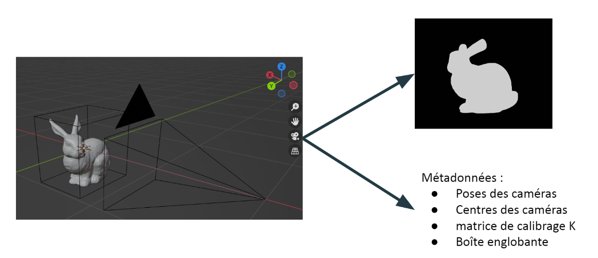
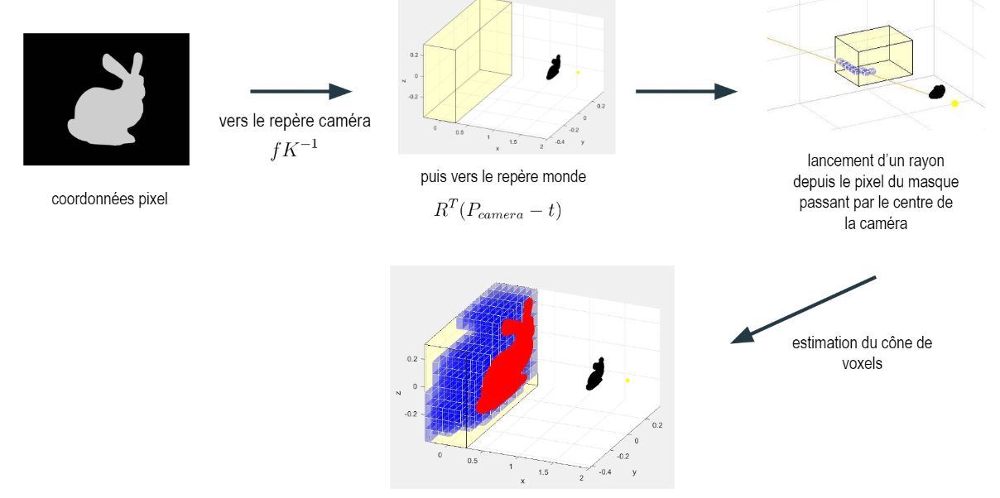
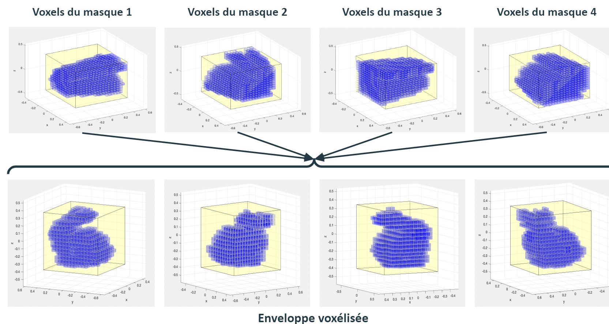

### Contexte
Ce projet a été réalisé dans le cadre du cours "Problèmes inverses pour la 3D" durant mes études à l'N7. L'objectif est de proposer une méthode de reconstruction 3D par stéréoscopie multi-vues (MVS) pour reconstruire un objet opaque plongé dans un milieu réfringent, en l'occurrence un insecte piégé dans l'ambre. Nous avions, pour cela,  utilisé des images de synthèse de Bunny par Blender. Dans un premier temps, nous avons considéré que le milieu n'est pas régringeant afin de modéliser le chemin des rayons lumineux à travers ce milieu. Nous avons utilisé une méthode de résolution discrète de l'espace afin de construire l'enveloppe voxélisée de l'objet. 

### Guide
- _read_data.m_ : permet de lire les données générées par Blender dans "./metadata/masques" et "./metadata/matrices". Ces métadonnées sont stockées dans le fichier "lapin.mat".

- _calcul_voxels.m_ : permet de calculer les voxels correspondants à chaque masque ou position de caméra. Les résultats sont stockés sous la forme de fichiers ".mat" dans "./metadata".
Pendant le calcul (calcul_voxel=true), il est possible d'activer l'affichage complet des résultats (verbose=true): voxels + points d'incidence. Mais ce dernier ralentit le temps d'exécution. Il est recommandé d'utiliser le deuxième affichage comme expliqué ci-dessous.
Si les calculs sont déjà effectués, le script permet aussi de réaliser un affichage simple (calcul_voxel=false; affichage_voxel=true).

- La fonction _amanatidesWooAlgorithm_AP_adapte.m_ lance les rayons pour chaque couple "origin/direction" et retourne l'ensemble des indices des voxels parcourus de la "grid3D", ainsi que leur coordonnées xyz nécessaires pour l'affichage.

- _enveloppe.m_ charge les données générées par _calcul_voxels.m_ et estime la reconstruction 3D grossière de l'objet par intersection sur les ensembles de voxels.

### Génération des données avec Blender

### Pipeline de création d'un cône de la silhouette 

### Création de l'enveloppe voxélisée

